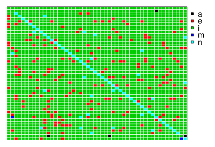
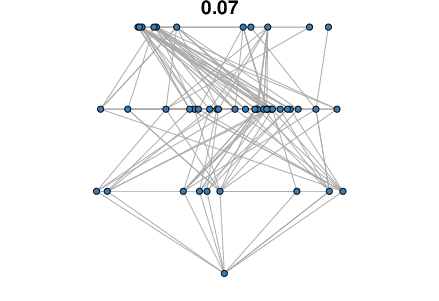

## Lego project
JD Yeakel, MM Pires, MAM de Aguiar, J O'Donnell, PR Guimarães, T Gross

#Background
We aim to explore community assembly and dynamics by considering a basic set of underlying, asymmetric interactions between species and their local environment.
As such, the presence of a species within a community is a function of whether a suite of dependencies is met with regard to its needs, and the needs of the other species in the system.
The set of one-way interactions are:
```S
A: avoid
N: need
I: ignore
M: make
E: eat
```
These interactions are asymmetric in the sense that if Sp. A has an ``` M ``` interaction with Sp. B, the reverse interaction from Sp. B to Sp. A is limited.
For example, if Sp. A *eats* Sp. B, Sp. B can either *ignore*, *make*, or *eat* Sp. A, but it could not *avoid* Sp. A, because then the original interaction could not occur.
The full set of pairwise interactions from which these dependencies arise are

Sp A | Sp B
--- | ---
E | {I, M, E}
M | N
I | {A, N, I, E}
N | {N, I, M, E}
A | {A, I}

The available combinations of potential interactions each have ecological analogues.
This is obviously important, because we aim for this project to shed light on ecosystem assembly and function.
The potential interactions, and their ecological mappings are

Interaction | Biological meaning (DNE = Does Not Exist)
--- | ---
{N,E} | Facultative mutualism
{N.N} | Obligate mutualism
{N,I} | Commensalism
{I,A} | Asymmetric unstable competition
{A,A} | Symmetric unstable competition
{I,E} | Asymmetric predation
{M,N} | Engineering
{I,I} | Stable competition, coexistence
{E,E} | Symmetric predation
{N,A} | DNE
{E,A} | DNE
{M,M} | DNE
{M,A} | DNE
{M,I} | DNE
{M,E} | DNE


**Details in establishing interactions between species/objects**
* These interactions account for interactions between species, as well as interactions between species and objects that they either depend on or create.
For example, Sp. A might have a *make* interaction ```m``` with Object B (e.g. an organic molecule).
Object B will then have a *need* interaction ```n``` with Sp. A (because the presence of Sp. A is required for Object B to exist).
Another species, Sp. C might *need* Object B.
If, for some reason, Sp. A goes extinct, Object B will disappear, and Sp. C will then go extinct in a cascade.
The interconnections between dependencies that are built into the system thus have a large effect on the potential dynamics.
To distinguish between living and nonliving players (for lack of a better word) in the system, a living player *needs* itself to exist; a nonliving player *ignores* itself.
* To ensure that energy flows from the bottom up, an basal object - the sun - exists in all systems, ignoring all players in the system, but existing as a consumptive energy source.
* There are a few of these interactions that seem strange... for example, asymmetric predation (where there is a predator-prey pair) consists of an ```e``` interaction from the predator to the prey, and an ```i``` interaction from the prey to the predator.
The idea that the prey *ignores* the predator stems from the assumption that the species within the communities that we are examining exist in some steady state... that is, if the suite of dependencies allow for the species to exist in the community, then we assume that its population exists in some kind of stable state, where the dependencies function only to determine its presence/absence.
So the idea that the prey *ignores* the predator essentially means that although the prey population might be depressed from consumption by the predator population, it still exists in the system, so with respect to existence/nonexistence, the prey is ignoring the predator.

Our first goal was to use these rules to assemble a *template* of interactions between species (and the objects that they might interact with or create).
The master template maps all interactions between players in the system.

**Building subset communities**
Our second goal was to randomly assemble a community of species/objects from the master template.
The current method is to randomly pick species/objects from the master template, and assemble a new *local community*.
After the local community is assembled, there will be a number of species/objects that will be immediately lost from the system because their dependencies are not fulfilled. For example, if a consumer of chosen, but none of its prey are present, that consumer will immediately go extinct.
After this initial culling, we will be left with a group of species/objects that fulfill coexistence criteria.
In addition to the criteria introduced from the list of interactions, we imposed a small number of additional rules:

Additional Rules
1. Make Rule: if A ```m``` B, then B ```i``` everything, except B ```n``` A
2. Coexistence/Competition Rule: if similarity(A,B) > $t_c$; then A ```a``` B, where $t_c$ is some avoidance threshold.
3. Consumption Rule: Living players must consume something: $\sum(e) > 0$
4. Sun Rule: Row/Column 1 of the community adjacency matrix is the sun.
5. If there are no primary producers in the system (living players that have an ```e``` interaction with the sun), the system implodes and is drawn again.


#Preliminary results
**Figure 1.** An example of a master template is shown below in matrix form.
Note that the diagonal determines whether the player is a living species or a nonliving object.
Also note that the master tempalate does not need to meet all coexistence criteria, as it exists only to document who interacts with whom, and in what way.


**Figure 2** An example of the food web embedded within the master template.
This network is just the subset of ```e``` interactions, and again is not expected to exist on its own, as a local community would be composed of a subset of living/nonliving player from the master template.


#Short-term aims
1. Analyze different properties of the subsampled communities as a function of size. One set of attributes that we will focus on are scaling relationships, where differential persistence of species are expected to generate different scaling relationships depending on the probabilities of the interaction types in the master template.
2. Determine other properties of stable sub-communities, and how they change with different probability distributions of interaction types for the master template.

#Long-term aims
1. Assemble sub-communities on a spatial lattice and allow for colonization between neighboring lattice sites
2. Are there stable communities that emerge over time? Is there a spatial component to community assembly that might be reminiscent of biomes?
3. Insert an evolutionary component to assembled communities, such that living players can speciate via small changes to their interactions





